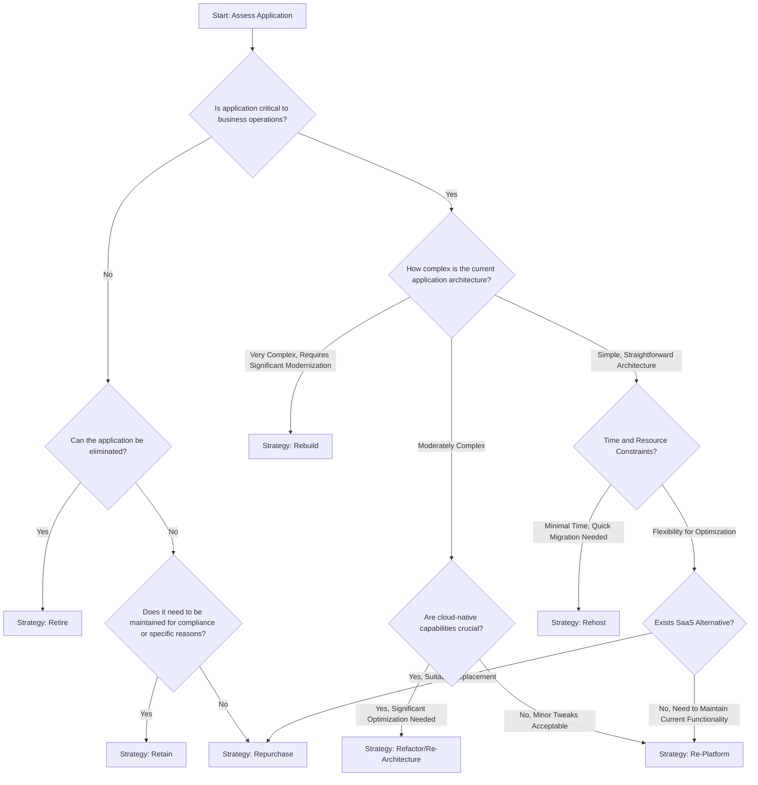

# Main Cloud Migration Strategies

Cloud migration options are commonly referred to as the "6 Rs" of cloud migration, 

1. Rehost
2. Re-platform
3. Refactor / Re-architecture
4. Repurchase (move to a SaaS, generally)
5. Retire
6. Retain

but arguably we could also consider two more

7. Rebuild
8. Replace

## Exploring the strategies

### __Rehost (Lift and Shift)__ 
This approach involves moving applications to the cloud with minimal modifications. It's the quickest and least complicated (which does not necessarily mean simple or not time consuming) migration method, essentially transferring existing servers and applications to cloud infrastructure without changing the code. This approach can be suitable for organizations with time-sensitive migration needs, limited cloud expertise, a large portfolio that precludes a cloud journey towards PaaS, or applications that don't require immediate optimization. Pros include rapid migration, minimal disruption, and lower immediate transformation costs. Cons include missed opportunities for cloud-native optimization, potentially higher long-term operational costs (that many VMs) due to the large IaaS footprint, and limited scalability. It's probably something not done massively anymore in 2024, and it constitutes the less mature stage in a cloud journey. It can also be a trap that is difficult to move out of. Once you are "in the cloud", your business stakeholders might be already expecting the miracle of technology to manifest itself, and there can be less incentive towards continuing the journey with cloud-native modernization.

To sum up:
- Minimal immediate skill transformation needed, especially if a vendor is handholding you
- Quickest migration path, ideal if you need to meet tight deadlines to tell your stakeholders, investors etc that "you are in the cloud"
- Limited initial disruption to existing processes, which has less friction and requires less discussion and stakeholder management, but can be probably a bad thing since inefficient processes remain unchanged
- Potential for future optimization, which alternatively means limited immediate cloud-native benefits are obtained
- May introduce some sort of complacency or reluctance to move forward in the cloud journey for those applications that merit it - applications that are thus migrated tend to remain and linger in that state for too long if they seem to "just work", especially in large portfolios
- Constraints include higher operational costs in the long-term 
- Underutilization of cloud capabilities can mean missing strategic value

### Re-platform (Lift, Tinker, and Shift)
A middle-ground strategy where applications are migrated with some cloud optimization but without complete redesign, think for example moving only some parts of the systems that are clear-cut and not tangled in a web of dependencies (admittedly rare, but could be the case), ancillary services, or new requirements that could be implemented as a separate piece instead of adding to the monolith you already have. This might also involve modernizing a tier to leverage some cloud capabilities, such as migrating to a managed database offering or implementing basic auto-scaling, with minor modification to your codebase, such as removing or relocating persistent user state or sessions. 

This migration option is suitable for key parts of the portfolio where reaping cloud benefits in an incremental while removing the risk (or the impossibility) of a full re-architecture is warranted. A technical feasibility assessment should be done to find out if this is the right option and how far to go with the modernization. Pros of this option include moderate performance improvements, some cost or operational optimization, and reduced migration complexity avoiding riskier models. Cons include incomplete cloud-native transformation and potential ongoing performance limitations.

Presents more moderate organizational risks:
- Enables faster wins for operational improvements while postponing full transformation
- Partial skill transformation requirements, depends how far it goes
- Potential performance inconsistencies
- Could require the ability to develop different parts of the system with lifecycles that move at different paces (IT Speeds etc)
- Requires more diversity of skills in teams, but that will generally be a good thing
- Incremental changes may not deliver expected benefits, or present too many issues and technical problems that render the solution moot - this is a bit of a blatitude since a statement like this applies to basically every project
- Risk of creating hybrid environments that are harder to manage (operationally, skills, as mentioned)
- Incomplete optimization of cloud capabilities
- As with the previous approach, this one too risks perpetuating legacy issues in partially modernized systems that never fully modernize

### Refactor/Re-architecture
A comprehensive transformation where applications are significantly redesigned to fully leverage cloud-native architectures, typically involving microservices, containerization, and serverless technologies, but with the same codebase. Theoretically, best for mission-critical applications where performance, scalability, and innovation are paramount. Pros include maximum cloud efficiency, enhanced performance, improved scalability, and future-proofing. Cons include high complexity, substantial time investment, significant expertise requirements, and potentially high transformation costs.

A close second in risk profile, with critical organizational challenges:
- Requires extensive retraining of existing development teams
- Substantial cultural resistance to fundamental architectural changes
- High likelihood of introducing new technical debt while attempting to eliminate old debt - seen this happening a few times in spites of assurances and promises and it is nothing related to the cloud
- Complexity of managing parallel systems during migration
- Potential outages or performance degradations during transition milestones
- Significant investment in new tooling and development practices
- Two sides of the same coin: better possibilities of incorporating newer technologies at the risk of over-engineering solutions
- Requires robust governance to prevent scope/feature creep and ensure alignment with business goals (the "since you are already working on this application" syndrome)
- Can lead to just containerizing big applications that suffer no modification to their architecture and thus you end running huge pods that are just VM's in disguise

### Repurchase (Replace with SaaS)
Replacing existing on-premises or custom applications with COTS or commercial Software-as-a-Service (SaaS) solutions. Ideal for standardized business functions like Field Services, CRM, HR, Marketing & Communications where specialized cloud solutions exist. Pros include immediate cloud benefits, reduced maintenance overhead, automatic updates, and typically lower total cost of ownership. Cons include potential loss of customization, vendor lock-in, and possible data migration challenges when moving out of your silos and proprietary custom solutions. Political issues might arise with stakeholders clinging to their beloved applications (and the budget that goes with them), so perhaps the main risks with this strategy fall in the organizational category:

- Vendor lock-in challenges, often for the long term
- Data migration and integration complexities
- Potential misalignment between SaaS capabilities and specific business processes (you are guaranteed to have many complains here as people protect their turfs, aka job security and org chart relevance)
- User adoption and change management difficulties
- Hidden costs of customization and integration - which often happens with the siren song the implementing vendor will no doubt offer
- Loss of unique competitive advantages embedded in custom solutions - albeit you can build an ecosystem of enhanced services on top of a COTS product, and this is only a maybe, since you could be repurchasing some system that is not really a core differentiator and more of a standard function everyone already has
- A classic one: let developers / IT teams to focus on core innovations by offloading standard non-differentiating functionalities
- Integration with existing and/or new systems will require APIs, migrations or worse mechanisms, adding unforeseen costs, efforts and increasing overall system complexity
- Evaluate your SaaS adoption with longer term business strategies and consider vendor-related risks.

### Retire 
Decommissioning applications that are no longer necessary or valuable to the business. This strategy involves identifying and eliminating redundant, obsolete, or inefficient applications during the migration process. Beneficial for organizations looking to streamline their IT portfolio, reduce maintenance costs, and simplify their infrastructure. Pros include reduced complexity, lower operational costs, and improved security by eliminating unnecessary systems. Cons might include potential disruption to business processes and the need for careful impact assessment. This is the approach with the lowest perceived organizational risk:

- Simplifies IT portfolio and frees up IT resources
- Reduces maintenance overhead
- Potential cost savings
- Risks include potential loss of legacy functionality, especially if there are dark corners of undocumented functionality that no one knows anymore about and that could impact workflows in legacy systems with low utilization. Apply the "pull the cable and listen for the swearing" principle (aka perform impact assessment)
- Again, there might be some people clinging to those systems for justification

### Retain
Keeping certain applications in their current environment, either due to compliance requirements, recent upgrades, or technical constraints. This might involve postponing migration or maintaining a hybrid infrastructure. Perhaps it is not worthy, not feasible or sunset is expected to happen soon (although I've seen systems that have outlived their roadmapped decomissions for years). Appropriate for highly specialized applications, those with complex dependencies (think Team Topologies' [complicated subsystems](https://teamtopologies.com/key-concepts) and beyond), systems with recent significant investments, or situation where risk, cost and timelines are too high (let the next C*O eat that one). Technology availability could eventually become a killer, though. Pros include minimal immediate disruption and preservation of recent technology investments - or even further amortization. Cons include missed cloud benefits, potential increased complexity in managing hybrid environments, and potential long-term inefficiencies.

- Preserves existing infrastructure and knowledge
- Minimal immediate disruption, but inefficiencies are kept as-is
- Allows for strategic planning
- Potential constraints include mounting technical debt
- Increasing maintenance costs
- Reduced competitive agility
- Threatened stakeholders and their turfs, evaluate that and have a communication strategy ready and a clean way forward, or out, for those stakeholders
- Some sort of eventual way out must be in place ... eventually

### Rebuild
A comprehensive strategy involving complete application reconstruction using cloud-native technologies and modern development approaches. Most suitable for legacy applications that are fundamentally incompatible with cloud environments or require complete modernization. Pros include maximum technological flexibility, opportunity to incorporate latest architectural patterns, and potential for significant performance improvements. Cons include extremely high transformation costs, extended development timelines, and substantial organizational disruption. 

This strategy carries the highest organizational risk due to its ambitious and comprehensive nature. 

- Massive skill gap between existing "legacy IT teams" and cloud-native technologies team, which can potencially introduce serious issues between the lifers and those hip trendy new hires
- Underestimation of complexity in complete application reconstruction, which always happend and I will explore in a future article
- Significant budget overruns, often 2-3x initial estimates - and missed deadlines - as per the previous point 
- Prolonged development cycles leading to business functionality gaps, or forces a classic two-pronged approach where the legacy systems still acquires new functionality downstream from the new one, or even bidirectionally between old and new (features, fixes). What could go wrong?
- The previous point tend to happen as timelines that are inevitably extended will reduce stakeholder patience and support (or their ability or appetite for forking out some more budget) for the project
- Potential loss of institutional knowledge during complete rewrite - poor team management could mean you lose key knowledge mid-air
- High probability of scope creep and endless refinement cycles
- Risk of creating more complex systems than the original application was, because of creep, new bugs created on top of the ones who were ported to the new system from the original, because there will be pressure to cut corners, "reuse" code and not change the processes too much
- Nice opportunity to score some ESG points with your audience & investors and introduce green computing practices and a more sustainable or leaner architecture and cloud offerings
- Requires focus on change management, communication and phased development to maintain organizational confidence and drive

### Replace
Involves substituting existing applications with entirely new solutions that better meet business requirements. This might mean changing vendors or developing new custom applications that are more aligned with current business needs. Ideal for scenarios where existing applications are severely limited or where business processes have significantly evolved. Pros include opportunity for radical improvement, potential cost savings, and alignment with current business strategies. Cons include potential high initial investment, risk of business disruption, and challenges in data migration and user adaptation.

- Opportunity for a strategic pivot to adopt modern best practices, technically and even organizationally
- High likelihood of disruptions in entrenched processes & constituencies
- Needs leadership alignment and transparent communication to manage resistance and smooth transition

## How to implement an encompassing cloud migration strategy
To successfully navigate these migration approaches, organizations should:

1. Develop a robust cloud competency center
2. Invest heavily in continuous skills training
3. Create detailed migration roadmaps with clear exit criteria
4. Implement phased migration approaches
5. Establish strong governance and architectural review boards
6. Develop comprehensive change management programs
7. Create fallback and rollback mechanisms
8. Maintain open communication channels across IT and business units

Emerging Complexity Factors:
- Increasing regulatory compliance requirements
- Cybersecurity challenges
- Multi-cloud and hybrid cloud environments
- Rapid technological evolution
- Increasing complexity of distributed systems

Key Organizational Capabilities for Successful Migration:
- Cloud architecture expertise
- Strong change management practices
- Continuous learning culture
- Financial flexibility
- Strategic technological vision
- Cross-functional collaboration
- Risk management maturity

Recommendation: Most organizations should start with Rehost or Re-Platform strategies to build cloud migration experience, then progressively move to more complex strategies like Refactor or Rebuild as organizational cloud maturity increases.

## Repatriation

Cloud Repatriation or Edge/On-Premises Retention, sometimes referred to as "Cloud Exit" or "Cloud Repatriation" has gained some recent attention due to some famous articles. A Cloud Repatriation/Edge Retention Strategy involves either deliberately choosing to maintain on-premises infrastructure or moving workloads back from public cloud environments to private data centers or edge computing infrastructure. It's a strategic counterpoint to the widespread cloud migration trend, acknowledging that cloud isn't always the optimal solution for every technological context, in spite of the hype and the bandwagon effect.

Ideal candidates for this strategy include organizations with specific regulatory constraints, high-performance computing requirements, predictable and stable workloads, sensitive data processing needs, or those experiencing unexpectedly high public cloud operational costs. Industries like financial services, healthcare, government, scientific research, and certain manufacturing sectors often find compelling reasons to retain or repatriate infrastructure.

Pros:
- Complete control over infrastructure and data sovereignty
- Predictable, potentially lower long-term operational costs - at least you are reducing your exposure to unilateral prices / licenses increases in exchange for not offloading that much responsibility to the vendor
- Enhanced security for sensitive workloads
- Elimination of cloud vendor dependencies
- Precise performance tuning capabilities
- No recurring cloud service expenses
- Compliance with strict regulatory environments
- Reduced network latency for specific compute-intensive applications
- Full customization of hardware and network configurations

Cons:
- Significant upfront capital expenditure
- Requires sophisticated internal IT infrastructure expertise
- Ongoing maintenance and refresh responsibilities
- Limited scalability compared to cloud elasticity
- Higher costs for disaster recovery and redundancy
- Increased complexity in managing hardware lifecycle
- Reduced access to cutting-edge cloud-native services
- Manual scaling and capacity planning
- Higher energy and cooling infrastructure investments

Organizational Constraints and Challenges:
1. Skill Set Requirements
- Demands highly specialized infrastructure engineering talent
- Requires continuous training in evolving hardware technologies
- Needs comprehensive understanding of capacity planning
- Demands advanced networking and security expertise

2. Financial Considerations
- Substantial initial and ongoing capital expenditures
- Complex total cost of ownership calculations
- Need for precise workload forecasting
- Investment in redundancy and disaster recovery infrastructure

3. Technological Constraints
- Limited access to rapid technological innovation
- Manual management of hardware refresh cycles
- Reduced flexibility in scaling computational resources
- Higher complexity in distributed computing scenarios

4. Operational Challenges
- 24/7 infrastructure management responsibilities
- Complex compliance and security maintenance
- Higher overhead for monitoring and maintenance
- Limited global distribution capabilities

5. Performance and Scalability Limitations
- Fixed computational capacity
- Manual resource allocation
- Potential underutilization during low-demand periods
- Increased complexity in dynamic workload management

Risk Mitigation Strategies:
- Develop comprehensive workload analysis frameworks
- Implement hybrid infrastructure approaches
- Create flexible, modular infrastructure designs
- Invest in advanced monitoring and optimization tools
- Maintain continuous skills development programs
- Develop robust disaster recovery and business continuity plans

Emerging Trends Supporting On-Premises/Edge Retention:
- Advanced edge computing technologies
- Specialized hardware accelerators
- Increased focus on data sovereignty
- Development of more efficient, compact infrastructure solutions
- Growth of software-defined infrastructure approaches
- Enhanced virtualization and containerization technologies

Decision Criteria for Repatriation:
1. Consistent, predictable workload characteristics
2. Regulatory compliance requirements
3. High-performance computing needs
4. Sensitive data processing
5. Cost-effectiveness analysis
6. Strategic technological independence
7. Customization requirements
8. Long-term total cost of ownership

Cloud repatriation represents a mature technological strategy that recognizes no single infrastructure approach fits all scenarios. It's a nuanced response to the one-size-fits-all cloud migration narrative, emphasizing contextual technological decision-making. The most sophisticated organizations view infrastructure as a strategic portfolio, dynamically balancing cloud, on-premises, and edge computing based on specific workload characteristics and organizational objectives.

